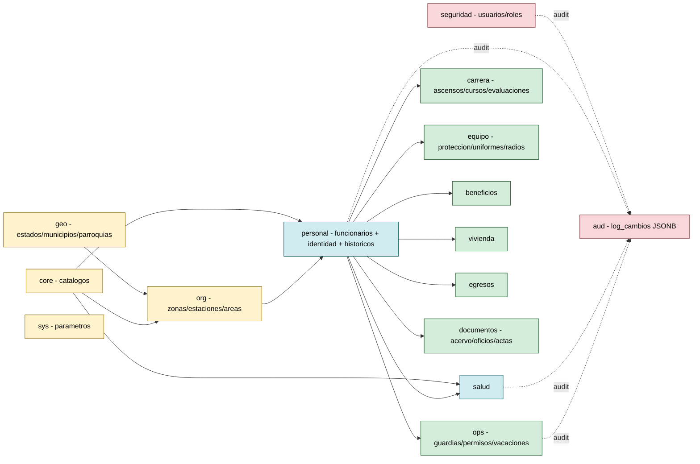
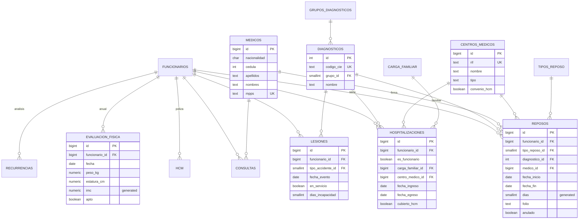
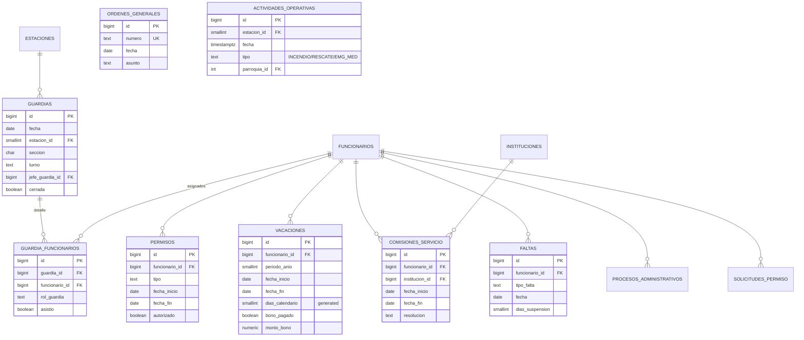
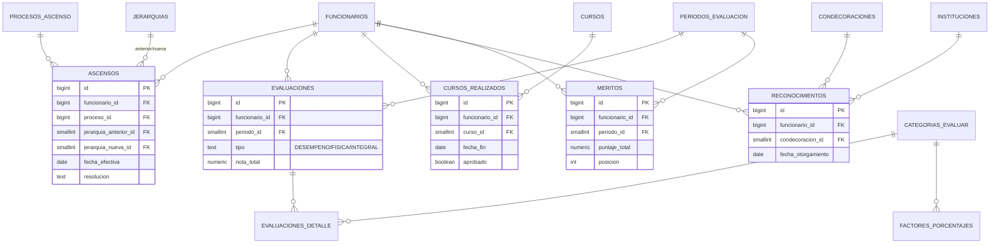
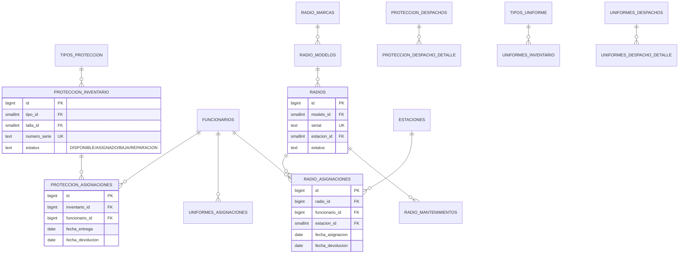
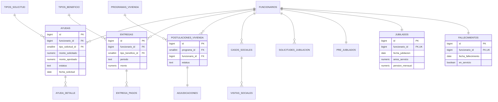
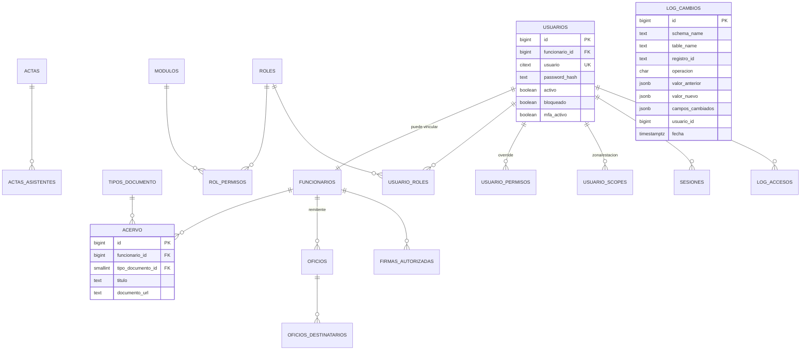

# Modelo Entidad-Relación

GitHub renderiza Mermaid directamente, por lo que esta página es navegable sin instalar nada.
Para una vista interactiva (zoom, pan, exportar PNG/PDF) usa el archivo
[`schema.dbml`](./schema.dbml) en https://dbdiagram.io/d (File → Import → DBML).

---

## 0. Vista general — schemas y dependencias principales

---

## 1. Personal — núcleo de funcionarios

```mermaid
erDiagram
    FUNCIONARIOS ||--o{ PERIODOS_SERVICIO : "1..N ciclos"
    FUNCIONARIOS ||--o{ HISTORICO_JERARQUIAS : "ascensos"
    FUNCIONARIOS ||--o{ HISTORICO_UBICACIONES : "movimientos"
    FUNCIONARIOS ||--o{ HISTORICO_CONDICIONES : "transiciones"
    FUNCIONARIOS ||--o{ HISTORICO_NUMEROS_EQUIPO : "asignaciones"
    FUNCIONARIOS ||--o{ DIRECCIONES : "una actual"
    FUNCIONARIOS ||--o{ CARGA_FAMILIAR : "dependientes"
    FUNCIONARIOS ||--o{ EDUCACION : "titulos"
    FUNCIONARIOS ||--o{ HABILIDADES : "idiomas/skills"
    FUNCIONARIOS ||--o{ ACTIVIDADES : "extracurriculares"
    FUNCIONARIOS ||--o{ TIEMPO_ADMPUBLICA : "trabajo previo"
    FUNCIONARIOS ||--o{ CUENTAS_BANCARIAS : "una actual"
    FUNCIONARIOS ||--o{ LICENCIAS_CONDUCIR : "renovaciones"
    FUNCIONARIOS ||--o{ CARNETS : "cedula/patria/votacion"
    FUNCIONARIOS ||--|| REGISTRO_VOTACION : ""
    FUNCIONARIOS ||--o{ HOGARES_PATRIA : ""
    FUNCIONARIOS ||--o{ GDC_HABITACIONAL : ""

    JERARQUIAS ||--o{ FUNCIONARIOS : ""
    CARGOS ||--o{ FUNCIONARIOS : ""
    CONDICIONES ||--o{ FUNCIONARIOS : ""
    ZONAS ||--o{ FUNCIONARIOS : ""
    ESTACIONES ||--o{ FUNCIONARIOS : ""

    FUNCIONARIOS {
        bigint id PK
        char nacionalidad
        int cedula UK
        text apellidos
        text nombres
        text nombre_completo "generated"
        date fecha_nacimiento
        date fecha_primer_ingreso "inmutable"
        smallint jerarquia_id FK
        smallint cargo_id FK
        smallint zona_id FK
        smallint estacion_id FK
        text estatus "ACTIVO/REPOSO/JUBILADO..."
        text numero_empleado UK
        text numero_equipo
    }
    PERIODOS_SERVICIO {
        bigint id PK
        bigint funcionario_id FK
        smallint numero_periodo
        date fecha_ingreso
        date fecha_egreso "NULL=activo"
        text tipo_ingreso
        text tipo_egreso
        text numero_resolucion
        numeric monto_prestaciones
    }
    HISTORICO_JERARQUIAS {
        bigint id PK
        bigint funcionario_id FK
        smallint jerarquia_id FK
        date fecha_inicio
        date fecha_fin
        text motivo
        text resolucion
    }
    HISTORICO_UBICACIONES {
        bigint id PK
        bigint funcionario_id FK
        smallint zona_id FK
        smallint estacion_id FK
        smallint area_id FK
        smallint cargo_id FK
        date fecha_inicio
        date fecha_fin
    }
    HISTORICO_CONDICIONES {
        bigint id PK
        bigint funcionario_id FK
        smallint condicion_id FK
        date fecha_inicio
        date fecha_fin
    }
    HISTORICO_NUMEROS_EQUIPO {
        bigint id PK
        bigint funcionario_id FK
        text numero_equipo
        date fecha_inicio
        date fecha_fin
    }
    CARNETS {
        bigint id PK
        bigint funcionario_id FK
        smallint tipo_carnet_id FK "PATRIA/VOTACION/CIVICO/MILITAR..."
        text numero
        date fecha_emision
        date fecha_vence
    }
    CARGA_FAMILIAR {
        bigint id PK
        bigint funcionario_id FK
        text parentesco
        int cedula
        text apellidos
        text nombres
        date fecha_nacimiento
        boolean es_beneficiario_hcm
    }
    DIRECCIONES {
        bigint id PK
        bigint funcionario_id FK
        boolean es_actual "unique partial"
        int parroquia_id FK
        text direccion_completa
    }
    CUENTAS_BANCARIAS {
        bigint id PK
        bigint funcionario_id FK
        smallint banco_id FK
        text numero_cuenta
        boolean es_actual
    }
    LICENCIAS_CONDUCIR {
        bigint id PK
        bigint funcionario_id FK
        smallint tipo_licencia_id FK
        text numero
        date fecha_vence
        boolean es_actual
    }
    HOGARES_PATRIA {
        bigint id PK
        bigint funcionario_id FK
        text serial_carnet_patria
        smallint cantidad_personas
        boolean es_jefe_hogar
        boolean recibe_clap
    }
```

---

## 2. Salud

---

## 3. Operaciones (guardias, permisos, vacaciones, comisiones)

---

## 4. Carrera (ascensos, evaluaciones, cursos, méritos)

---

## 5. Equipamiento (protección, uniformes, radios)

---

## 6. Beneficios, vivienda, egresos

---

## 7. Documentos y seguridad

---

## Convenciones

- `||--o{` = uno a muchos · `||--||` = uno a uno · `--|{` = obligatorio
- `PK` = primary key · `FK` = foreign key · `UK` = unique
- `generated` = columna calculada (`GENERATED ALWAYS AS ... STORED`)
- Las cajas no muestran TODAS las columnas — solo las clave. El esquema completo está en `sql/02_dominio.sql` y en `docs/schema.dbml`.
