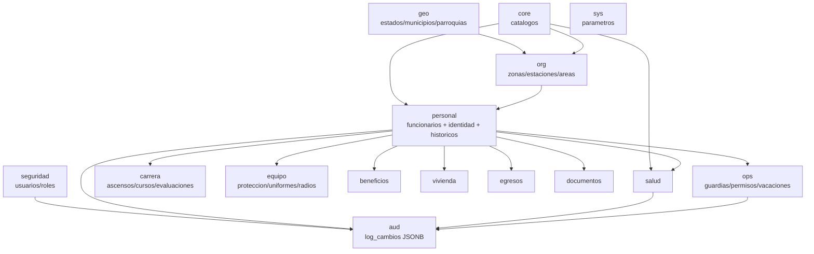
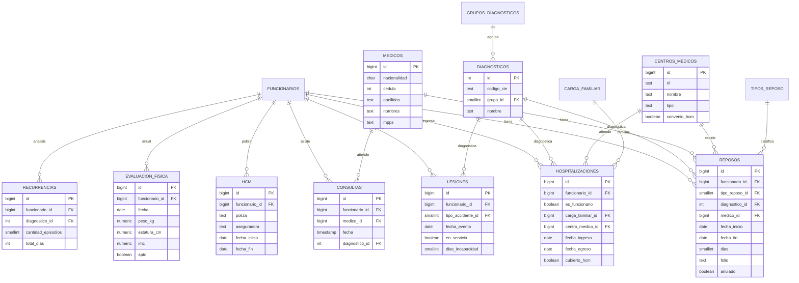
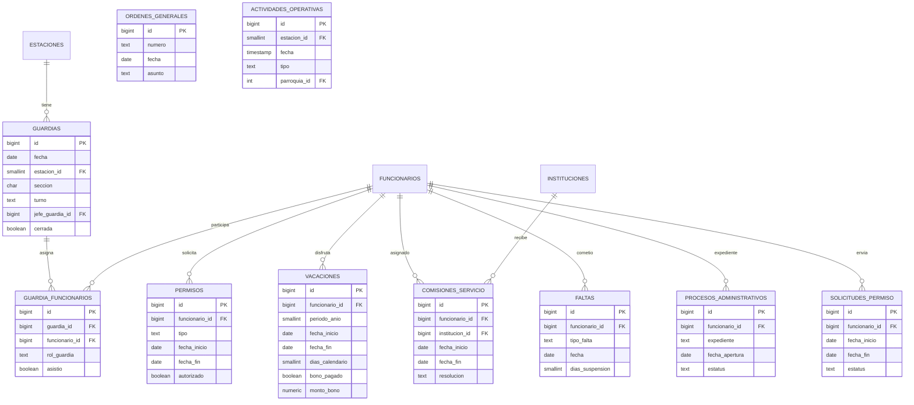
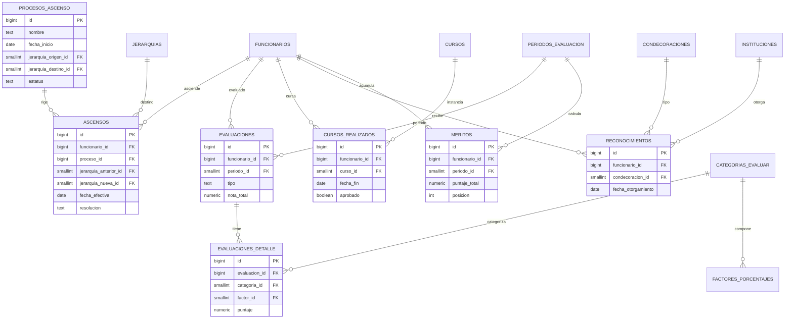
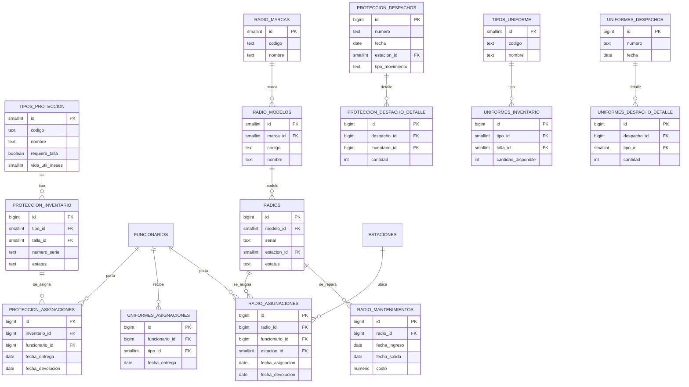
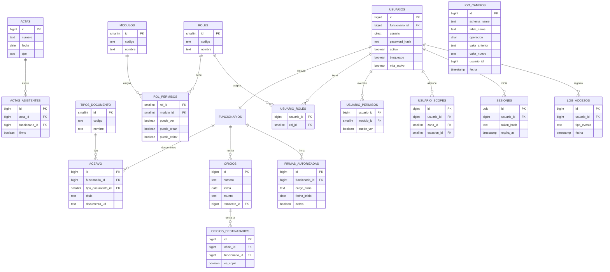

# Modelo Entidad-Relación

GitHub renderiza Mermaid directamente. Para vista interactiva con zoom, pan y export
a PNG/PDF usa [`schema.dbml`](./schema.dbml) en https://dbdiagram.io/d
(File → Import → DBML).

> Nota: Mermaid en GitHub solo acepta `PK` y `FK` como key annotations. Las cajas
> muestran solo columnas clave; el detalle completo está en `sql/02_dominio.sql`
> y en `schema.dbml`.

---

## 0. Vista general — schemas y dependencias

---

## 1. Personal — núcleo de funcionarios

```mermaid
erDiagram
    FUNCIONARIOS ||--o{ PERIODOS_SERVICIO : "ciclos"
    FUNCIONARIOS ||--o{ HISTORICO_JERARQUIAS : "ascensos"
    FUNCIONARIOS ||--o{ HISTORICO_UBICACIONES : "movimientos"
    FUNCIONARIOS ||--o{ HISTORICO_CONDICIONES : "transiciones"
    FUNCIONARIOS ||--o{ HISTORICO_NUMEROS_EQUIPO : "asignaciones"
    FUNCIONARIOS ||--o{ DIRECCIONES : "tiene"
    FUNCIONARIOS ||--o{ CARGA_FAMILIAR : "dependientes"
    FUNCIONARIOS ||--o{ EDUCACION : "titulos"
    FUNCIONARIOS ||--o{ HABILIDADES : "skills"
    FUNCIONARIOS ||--o{ ACTIVIDADES : "extras"
    FUNCIONARIOS ||--o{ TIEMPO_ADMPUBLICA : "previo"
    FUNCIONARIOS ||--o{ CUENTAS_BANCARIAS : "cuentas"
    FUNCIONARIOS ||--o{ LICENCIAS_CONDUCIR : "renovaciones"
    FUNCIONARIOS ||--o{ CARNETS : "tiene"
    FUNCIONARIOS ||--|| REGISTRO_VOTACION : "tiene"
    FUNCIONARIOS ||--o{ HOGARES_PATRIA : "tiene"
    FUNCIONARIOS ||--o{ GDC_HABITACIONAL : "postula"
    JERARQUIAS ||--o{ FUNCIONARIOS : "actual"
    CARGOS ||--o{ FUNCIONARIOS : "actual"
    CONDICIONES ||--o{ FUNCIONARIOS : "actual"
    ZONAS ||--o{ FUNCIONARIOS : "asignados"
    ESTACIONES ||--o{ FUNCIONARIOS : "asignados"

    FUNCIONARIOS {
        bigint id PK
        char nacionalidad
        int cedula
        text apellidos
        text nombres
        text nombre_completo
        date fecha_nacimiento
        date fecha_primer_ingreso
        smallint jerarquia_id FK
        smallint cargo_id FK
        smallint zona_id FK
        smallint estacion_id FK
        text estatus
        text numero_empleado
        text numero_equipo
    }
    PERIODOS_SERVICIO {
        bigint id PK
        bigint funcionario_id FK
        smallint numero_periodo
        date fecha_ingreso
        date fecha_egreso
        text tipo_ingreso
        text tipo_egreso
        text numero_resolucion
        numeric monto_prestaciones
    }
    HISTORICO_JERARQUIAS {
        bigint id PK
        bigint funcionario_id FK
        smallint jerarquia_id FK
        date fecha_inicio
        date fecha_fin
        text motivo
        text resolucion
    }
    HISTORICO_UBICACIONES {
        bigint id PK
        bigint funcionario_id FK
        smallint zona_id FK
        smallint estacion_id FK
        smallint area_id FK
        smallint cargo_id FK
        date fecha_inicio
        date fecha_fin
    }
    HISTORICO_CONDICIONES {
        bigint id PK
        bigint funcionario_id FK
        smallint condicion_id FK
        date fecha_inicio
        date fecha_fin
    }
    HISTORICO_NUMEROS_EQUIPO {
        bigint id PK
        bigint funcionario_id FK
        text numero_equipo
        date fecha_inicio
        date fecha_fin
    }
    CARNETS {
        bigint id PK
        bigint funcionario_id FK
        smallint tipo_carnet_id FK
        text numero
        date fecha_emision
        date fecha_vence
    }
    CARGA_FAMILIAR {
        bigint id PK
        bigint funcionario_id FK
        text parentesco
        int cedula
        text apellidos
        text nombres
        date fecha_nacimiento
        boolean es_beneficiario_hcm
    }
    DIRECCIONES {
        bigint id PK
        bigint funcionario_id FK
        boolean es_actual
        int parroquia_id FK
        text direccion_completa
    }
    CUENTAS_BANCARIAS {
        bigint id PK
        bigint funcionario_id FK
        smallint banco_id FK
        text numero_cuenta
        boolean es_actual
    }
    LICENCIAS_CONDUCIR {
        bigint id PK
        bigint funcionario_id FK
        smallint tipo_licencia_id FK
        text numero
        date fecha_vence
        boolean es_actual
    }
    HOGARES_PATRIA {
        bigint id PK
        bigint funcionario_id FK
        text serial_carnet_patria
        smallint cantidad_personas
        boolean es_jefe_hogar
        boolean recibe_clap
    }
    REGISTRO_VOTACION {
        bigint id PK
        bigint funcionario_id FK
        text centro_electoral
        text mesa
    }
    GDC_HABITACIONAL {
        bigint id PK
        bigint funcionario_id FK
        text codigo_postulacion
        text programa
        text estado
    }
    EDUCACION {
        bigint id PK
        bigint funcionario_id FK
        smallint nivel_id FK
        text titulo
        text institucion
    }
    HABILIDADES {
        bigint id PK
        bigint funcionario_id FK
        text grupo
        text nombre
        text nivel
    }
    ACTIVIDADES {
        bigint id PK
        bigint funcionario_id FK
        text tipo
        text nombre
    }
    TIEMPO_ADMPUBLICA {
        bigint id PK
        bigint funcionario_id FK
        text institucion
        date fecha_inicio
        date fecha_fin
    }
```

---

## 2. Salud

---

## 3. Operaciones

---

## 4. Carrera

---

## 5. Equipamiento

---

## 6. Beneficios, vivienda, egresos

```mermaid
erDiagram
    FUNCIONARIOS ||--o{ AYUDAS : "solicita"
    FUNCIONARIOS ||--o{ ENTREGAS : "recibe"
    FUNCIONARIOS ||--o{ POSTULACIONES_VIVIENDA : "postula"
    FUNCIONARIOS ||--o{ CASOS_SOCIALES : "atendido"
    FUNCIONARIOS ||--o{ SOLICITUDES_JUBILACION : "solicita"
    FUNCIONARIOS ||--|| PRE_JUBILADOS : "es"
    FUNCIONARIOS ||--|| JUBILADOS : "es"
    FUNCIONARIOS ||--|| FALLECIMIENTOS : "registra"
    TIPOS_SOLICITUD ||--o{ AYUDAS : "tipo"
    TIPOS_BENEFICIO ||--o{ ENTREGAS : "tipo"
    AYUDAS ||--o{ AYUDA_DETALLE : "tiene"
    ENTREGAS ||--o{ ENTREGA_PAGOS : "tiene"
    PROGRAMAS_VIVIENDA ||--o{ POSTULACIONES_VIVIENDA : "incluye"
    POSTULACIONES_VIVIENDA ||--|| ADJUDICACIONES : "resulta"
    CASOS_SOCIALES ||--o{ VISITAS_SOCIALES : "visitas"

    AYUDAS {
        bigint id PK
        bigint funcionario_id FK
        smallint tipo_solicitud_id FK
        numeric monto_solicitado
        numeric monto_aprobado
        text estatus
        date fecha_solicitud
    }
    AYUDA_DETALLE {
        bigint id PK
        bigint ayuda_id FK
        text concepto
        numeric monto_total
    }
    ENTREGAS {
        bigint id PK
        bigint funcionario_id FK
        smallint tipo_beneficio_id FK
        text periodo
        numeric monto
    }
    ENTREGA_PAGOS {
        bigint id PK
        bigint entrega_id FK
        numeric monto
        date fecha
    }
    POSTULACIONES_VIVIENDA {
        bigint id PK
        smallint programa_id FK
        bigint funcionario_id FK
        text estatus
    }
    ADJUDICACIONES {
        bigint id PK
        bigint postulacion_id FK
        date fecha_adjudicacion
        text direccion
    }
    CASOS_SOCIALES {
        bigint id PK
        bigint funcionario_id FK
        text tipo_caso
        date fecha_apertura
        text estatus
    }
    VISITAS_SOCIALES {
        bigint id PK
        bigint caso_id FK
        date fecha
        bigint visitador_id FK
    }
    PRE_JUBILADOS {
        bigint id PK
        bigint funcionario_id FK
        date fecha_inicio
        numeric pension_estimada
    }
    JUBILADOS {
        bigint id PK
        bigint funcionario_id FK
        date fecha_jubilacion
        numeric anios_servicio
        numeric pension_mensual
    }
    FALLECIMIENTOS {
        bigint id PK
        bigint funcionario_id FK
        date fecha_fallecimiento
        boolean en_servicio
    }
    SOLICITUDES_JUBILACION {
        bigint id PK
        bigint funcionario_id FK
        date fecha_solicitud
        text estatus
    }
    PROGRAMAS_VIVIENDA {
        smallint id PK
        text codigo
        text nombre
        int cupos_total
    }
    TIPOS_SOLICITUD {
        smallint id PK
        text codigo
        text nombre
    }
    TIPOS_BENEFICIO {
        smallint id PK
        text codigo
        text nombre
        text periodicidad
    }
```

---

## 7. Documentos y seguridad

---

## Convenciones

- `||--o{` = uno a muchos
- `||--||` = uno a uno
- `PK` = primary key · `FK` = foreign key
- Las cajas muestran solo columnas clave. El esquema completo está en
  [`../sql/02_dominio.sql`](../sql/02_dominio.sql) y en [`schema.dbml`](./schema.dbml).
